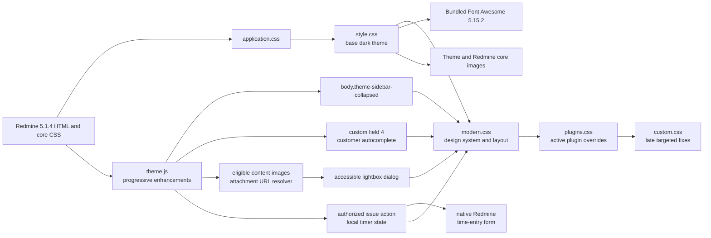

# Theme architecture

## Purpose

BS Redmine Theme Dark is a static presentation layer for
`Redmine 5.1.4.stable`. It does not replace Redmine views, controllers, models,
or plugin code. Its runtime contract is the directory layout Redmine expects
under `public/themes/<theme-name>`.

## Runtime flow

The order is behavioral: later stylesheets can intentionally correct earlier
specificity without duplicating the Redmine core stylesheet.

## File map

| Path | Responsibility |
| --- | --- |
| `stylesheets/application.css` | Entrypoint and immutable import order. |
| `stylesheets/style.css` | Legacy-compatible selector coverage, Font Awesome mappings, status and priority presentation. |
| `stylesheets/modern.css` | Design tokens, system typography, component refresh, accessible focus, flexible desktop layout, and responsive refinements. |
| `stylesheets/plugins.css` | Active optional-plugin overrides kept out of the core layer. |
| `stylesheets/custom.css` | Last-loaded fixes for wiki highlighting, SCM file views, diffs, and small local corrections. |
| `stylesheets/plugins/redmine_wysiwyg_editor.css` | Legacy TinyMCE/WYSIWYG integration; present but not imported by default. |
| `images/` | Time-tracking icons and a WYSIWYG modal texture owned by the theme. |
| `webfonts/` | Font Awesome 5.15.2 solid font in browser-compatible formats. |
| `javascripts/theme.js` | Isolated progressive enhancements for the accessible sidebar toggle, instance-specific customer autocomplete, content-image lightbox, and per-issue local timer. |
| `tests/` | Dependency-free behavior tests for sidebar, customer autocomplete, lightbox eligibility/accessibility, and timer persistence/native-form handoff. |
| `screenshot.png` | Historical design reference. |
| `scripts/validate_theme.rb` | Offline structure, path, glyph, and version-aware validation. |

## Styling domains

`style.css` retains roughly 350 legacy-compatible rule blocks. `modern.css`
normalizes those domains through semantic design tokens and focused overrides:

- global palette, typography, links, and headings;
- fixed top menu, header, project switcher, project navigation, content, sidebar,
  and footer;
- forms, Select2, checkboxes, radios, modals, flashes, and context menus;
- issue lists, issue detail, progress, history, tables, calendars, Gantt, wiki,
  repository, pagination, and tooltips;
- Font Awesome replacements for Redmine image icons;
- a responsive breakpoint below 899 px;
- optional numeric status and priority coloring.

## Assets and dependencies

- Typography uses a native system sans-serif stack and does not require a font
  service.
- Font Awesome 5.15.2 is local, so primary interface icons do not require a CDN.
- Theme images use paths relative to the theme stylesheet. A small set of core
  Redmine images uses `../../../images/`, which resolves from an installed theme
  back to `public/images/`.
- Sidebar, customer-autocomplete, lightbox, and issue-timer behavior use small
  dependency-free modules. No Sass, bundler, Node runtime, or compiled artifact
  is required in production.

## Sidebar behavior

Redmine 5.1.4 renders `#main` as a reverse-row flex container containing
`#sidebar` and `#content`. On desktop, the theme constrains the sidebar with a
responsive custom-property width and lets content flex into the remaining
space. `theme.js` inserts a real button only when the page has sidebar content.
It toggles `body.theme-sidebar-collapsed`, updates its accessible state, and
stores a boolean under `bs-redmine-theme-dark.sidebar-collapsed`.
When the optional Smile plugin exposes `#toggle-sidebar`, the theme suppresses
that legacy control after initialization to avoid two competing toggles.

Below 900 px, the button is hidden, the collapse class has no layout effect,
and Redmine's native flyout receives the sidebar content. Storage access is
guarded, so privacy modes that block `localStorage` keep a functional visible
sidebar.

## Customer autocomplete behavior

The second isolated module in `theme.js` activates only when Redmine renders
`select#issue_custom_field_values_4`. After successful initialization, it hides
the native select visually but retains it as the submitted form control. Search
and chip operations update native `<option>.selected` state and dispatch a
bubbling `change` event, preserving Redmine and plugin listeners.

The generated input follows combobox/listbox semantics and supports pointer,
Arrow Up/Down, Enter, Escape, Tab, and Backspace interactions. Option labels are
matched case- and accent-insensitively, up to 80 visible results. A guarded
`MutationObserver` supports dynamically inserted issue forms without creating
duplicate controls. All presentation remains in `modern.css`; when JavaScript
does not run, Redmine's original select remains visible and functional.

## History and activity presentation

Redmine 5.1.4 positions journal avatars with negative margins and gives activity
date headings a light background. `modern.css` replaces those assumptions with
bounded avatar columns, a theme-owned journal timeline, scoped note cards, and
paired activity `dt`/`dd` rows. The selectors retain Redmine's original markup,
event-type classes, journal anchors, and avatar-enabled/disabled body classes.

The narrow `> .note > .contextual` and `> .note > .wiki` rules are deliberate:
the legacy selector `#history .journal.has-notes > div > div` otherwise styles
both controls as comment cards. Avoid broadening these overrides without a
Redmine 5.1.4 history regression test.

## Image lightbox behavior

The third isolated `theme.js` module enhances eligible content images after the
page loads and through a guarded `MutationObserver`. Plain primary clicks open
one lazily created native `<dialog>` with `showModal()`, placing the preview in
the browser top layer; strongly scoped fixed-position CSS remains the fallback
when that API is unavailable. Modified clicks retain native link navigation.
Bare images receive keyboard button semantics, linked images reuse their
existing focusable anchor, and every eligible trigger exposes the hand pointer.

For same-origin Redmine paths, `/attachments/:id` and
`/attachments/thumbnail/:id/...` resolve to `/attachments/download/:id`, which
loads the original file through the user's existing Redmine authorization.
An ordinary link that points directly to an image is preferred next; otherwise
the rendered image source is retained. Avatars, emoji, user links,
editor-toolbar images, and non-image attachments are excluded. On close, body
scroll is restored and focus returns to the original trigger. Without JavaScript,
images and attachment links keep Redmine's native behavior.

## Local issue timer behavior

The fourth isolated `theme.js` module initializes only from Redmine 5.1.4's
same-origin `#content > .contextual > a.icon-time-add` action. Redmine renders
that link only when the current user may log time, so the theme does not invent
an authorization path or remove the original action. Top and bottom copies of
the issue action menu receive controls backed by the same issue record.

Active timers are stored as epoch start timestamps in one versioned
`localStorage` object, namespaced with the current user ID when it can be read
from `#loggedas`. Each issue ID is a separate key, so starting or finishing one
issue preserves every other active timer. Elapsed `HH:MM:SS` is recomputed from
`Date.now()` on each render, after reload, visibility changes, storage events,
and dynamic action-menu insertion; browser sleep does not depend on counting
interval callbacks.

Finishing removes only the current issue record and navigates to the native
`/issues/:id/time_entries/new` URL with `time_entry[hours]` and `back_url` query
parameters. Hours use nearest-minute rounding with a one-minute minimum.
Redmine still owns the issue, date, activity, comments, permissions, validation,
and final submission. Storage reads and writes are guarded; failure never
removes the native log-time link.

## Plugin boundary

Rules in `plugins.css` currently address Mega Calendar-style events, CMS, CRM,
Redmine Agile, timesheet forms, Favorite Project cards, and the Smile sidebar
toggle. Work Time icons live in the base stylesheet. These selectors express
presentation coverage, not a versioned plugin compatibility guarantee.

The WYSIWYG stylesheet is isolated because it targets legacy TinyMCE classes.
It can be enabled by uncommenting its import in `plugins.css`, followed by a
visual test of the installed plugin version.

## High-risk coupling

- Redmine markup and class names are the theme's API. Verify them against tag
  `5.1.4` before changing selectors.
- `status-N` and `priority-N` are database identifiers, not stable semantic
  names. Installations with different IDs receive different colors.
- Broad selectors and existing `!important` rules make import order significant.
- The mobile presentation begins below 899 px and shares the Redmine flyout menu
  markup.
- The sidebar toggle depends on the stable Redmine 5.1.4 IDs `main`, `sidebar`,
  and `content`; the validator records that runtime contract.
- The customer autocomplete is intentionally instance-specific and depends on
  the Redmine custom-field ID `issue_custom_field_values_4`. Other installations
  must map and test their own field ID before changing this selector.
- Journal and activity overrides depend on the Redmine 5.1.4 `#history`,
  `.journal`, `.note-header`, `#activity`, and adjacent `dt`/`dd` contracts.
- The lightbox URL resolver depends on Redmine 5.1.4 attachment, thumbnail, and
  download routes. It must remain same-origin and must never bypass attachment
  authorization.
- The issue timer depends on Redmine 5.1.4's `.icon-time-add` link and nested
  `/issues/:id/time_entries/new` route. Keep it same-origin, use the rendered
  link as the permission gate, and never auto-submit a time entry.
- Timer persistence is browser-local. It is not a reliable server record and
  can be lost when site data is cleared; the native form is the only submission
  boundary.
