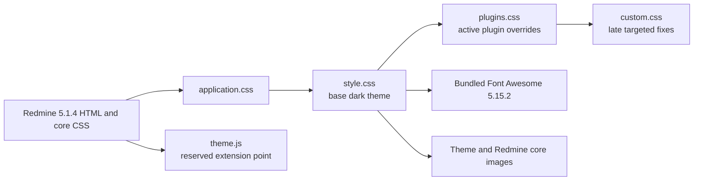

# Theme architecture

## Purpose

BS Redmine Theme Dark is a static presentation layer for
`Redmine 5.1.4.stable`. It does not replace Redmine views, controllers, models,
or plugin code. Its runtime contract is the directory layout Redmine expects
under `public/themes/<theme-name>`.

## Runtime flow

The order is behavioral: later stylesheets can intentionally correct earlier
specificity without duplicating the Redmine core stylesheet.

## File map

| Path | Responsibility |
| --- | --- |
| `stylesheets/application.css` | Entrypoint and immutable import order. |
| `stylesheets/style.css` | Dark palette, layout, Redmine components, responsive rules, icons, status and priority presentation. |
| `stylesheets/plugins.css` | Active optional-plugin overrides kept out of the core layer. |
| `stylesheets/custom.css` | Last-loaded fixes for wiki highlighting, SCM file views, diffs, and small local corrections. |
| `stylesheets/plugins/redmine_wysiwyg_editor.css` | Legacy TinyMCE/WYSIWYG integration; present but not imported by default. |
| `images/` | Time-tracking icons and a WYSIWYG modal texture owned by the theme. |
| `webfonts/` | Font Awesome 5.15.2 solid font in browser-compatible formats. |
| `javascripts/theme.js` | Deliberately behavior-free Redmine theme entrypoint. |
| `screenshot.png` | Historical design reference. |
| `scripts/validate_theme.rb` | Offline structure, path, glyph, and version-aware validation. |

## Styling domains

`style.css` contains roughly 350 rule blocks across these domains:

- global palette, typography, links, and headings;
- fixed top menu, header, project switcher, project navigation, content, sidebar,
  and footer;
- forms, Select2, checkboxes, radios, modals, flashes, and context menus;
- issue lists, issue detail, progress, history, tables, calendars, Gantt, wiki,
  repository, pagination, and tooltips;
- Font Awesome replacements for Redmine image icons;
- a responsive breakpoint below 899 px;
- optional numeric status and priority coloring.

## Assets and dependencies

- Roboto 400/400 italic/700 is requested from Google Fonts. Offline rendering
  uses the generic `sans-serif` fallback.
- Font Awesome 5.15.2 is local, so primary interface icons do not require a CDN.
- Theme images use paths relative to the theme stylesheet. A small set of core
  Redmine images uses `../../../images/`, which resolves from an installed theme
  back to `public/images/`.
- No JavaScript, Sass, bundler, Node runtime, or compiled artifact is required
  in production.

## Plugin boundary

Rules in `plugins.css` currently address Mega Calendar-style events, CMS, CRM,
Redmine Agile, timesheet forms, Favorite Project cards, and the Smile sidebar
toggle. Work Time icons live in the base stylesheet. These selectors express
presentation coverage, not a versioned plugin compatibility guarantee.

The WYSIWYG stylesheet is isolated because it targets legacy TinyMCE classes.
It can be enabled by uncommenting its import in `plugins.css`, followed by a
visual test of the installed plugin version.

## High-risk coupling

- Redmine markup and class names are the theme's API. Verify them against tag
  `5.1.4` before changing selectors.
- `status-N` and `priority-N` are database identifiers, not stable semantic
  names. Installations with different IDs receive different colors.
- Broad selectors and existing `!important` rules make import order significant.
- The mobile presentation begins below 899 px and shares the Redmine flyout menu
  markup.

