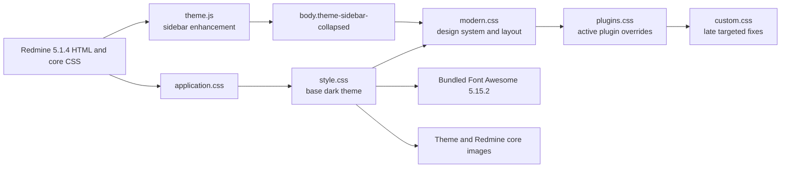

# Theme architecture

## Purpose

BS Redmine Theme Dark is a static presentation layer for
`Redmine 5.1.4.stable`. It does not replace Redmine views, controllers, models,
or plugin code. Its runtime contract is the directory layout Redmine expects
under `public/themes/<theme-name>`.

## Runtime flow

The order is behavioral: later stylesheets can intentionally correct earlier
specificity without duplicating the Redmine core stylesheet.

## File map

| Path | Responsibility |
| --- | --- |
| `stylesheets/application.css` | Entrypoint and immutable import order. |
| `stylesheets/style.css` | Legacy-compatible selector coverage, Font Awesome mappings, status and priority presentation. |
| `stylesheets/modern.css` | Design tokens, system typography, component refresh, accessible focus, flexible desktop layout, and responsive refinements. |
| `stylesheets/plugins.css` | Active optional-plugin overrides kept out of the core layer. |
| `stylesheets/custom.css` | Last-loaded fixes for wiki highlighting, SCM file views, diffs, and small local corrections. |
| `stylesheets/plugins/redmine_wysiwyg_editor.css` | Legacy TinyMCE/WYSIWYG integration; present but not imported by default. |
| `images/` | Time-tracking icons and a WYSIWYG modal texture owned by the theme. |
| `webfonts/` | Font Awesome 5.15.2 solid font in browser-compatible formats. |
| `javascripts/theme.js` | Accessible desktop sidebar toggle and local preference persistence. |
| `screenshot.png` | Historical design reference. |
| `scripts/validate_theme.rb` | Offline structure, path, glyph, and version-aware validation. |

## Styling domains

`style.css` retains roughly 350 legacy-compatible rule blocks. `modern.css`
normalizes those domains through semantic design tokens and focused overrides:

- global palette, typography, links, and headings;
- fixed top menu, header, project switcher, project navigation, content, sidebar,
  and footer;
- forms, Select2, checkboxes, radios, modals, flashes, and context menus;
- issue lists, issue detail, progress, history, tables, calendars, Gantt, wiki,
  repository, pagination, and tooltips;
- Font Awesome replacements for Redmine image icons;
- a responsive breakpoint below 899 px;
- optional numeric status and priority coloring.

## Assets and dependencies

- Typography uses a native system sans-serif stack and does not require a font
  service.
- Font Awesome 5.15.2 is local, so primary interface icons do not require a CDN.
- Theme images use paths relative to the theme stylesheet. A small set of core
  Redmine images uses `../../../images/`, which resolves from an installed theme
  back to `public/images/`.
- Sidebar behavior uses a small dependency-free script. No Sass, bundler, Node
  runtime, or compiled artifact is required in production.

## Sidebar behavior

Redmine 5.1.4 renders `#main` as a reverse-row flex container containing
`#sidebar` and `#content`. On desktop, the theme constrains the sidebar with a
responsive custom-property width and lets content flex into the remaining
space. `theme.js` inserts a real button only when the page has sidebar content.
It toggles `body.theme-sidebar-collapsed`, updates its accessible state, and
stores a boolean under `bs-redmine-theme-dark.sidebar-collapsed`.
When the optional Smile plugin exposes `#toggle-sidebar`, the theme suppresses
that legacy control after initialization to avoid two competing toggles.

Below 900 px, the button is hidden, the collapse class has no layout effect,
and Redmine's native flyout receives the sidebar content. Storage access is
guarded, so privacy modes that block `localStorage` keep a functional visible
sidebar.

## Plugin boundary

Rules in `plugins.css` currently address Mega Calendar-style events, CMS, CRM,
Redmine Agile, timesheet forms, Favorite Project cards, and the Smile sidebar
toggle. Work Time icons live in the base stylesheet. These selectors express
presentation coverage, not a versioned plugin compatibility guarantee.

The WYSIWYG stylesheet is isolated because it targets legacy TinyMCE classes.
It can be enabled by uncommenting its import in `plugins.css`, followed by a
visual test of the installed plugin version.

## High-risk coupling

- Redmine markup and class names are the theme's API. Verify them against tag
  `5.1.4` before changing selectors.
- `status-N` and `priority-N` are database identifiers, not stable semantic
  names. Installations with different IDs receive different colors.
- Broad selectors and existing `!important` rules make import order significant.
- The mobile presentation begins below 899 px and shares the Redmine flyout menu
  markup.
- The sidebar toggle depends on the stable Redmine 5.1.4 IDs `main`, `sidebar`,
  and `content`; the validator records that runtime contract.
